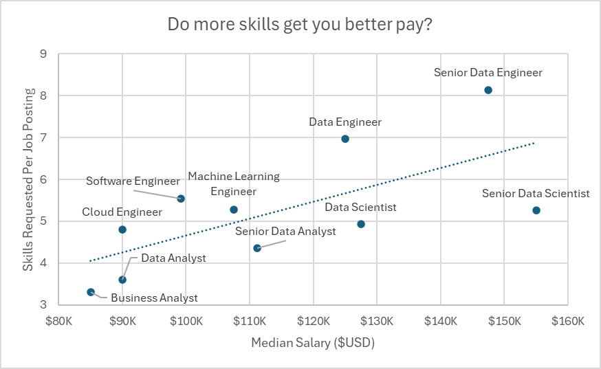

# Excel_Data_Analytics_Project
## Salary Dashboard
Dasbor gaji ini dibuat untuk membantu orang-orang yang sedang mencari kerja untuk mengetahui perkiraan gaji dari pekerjaan yang mereka inginkan.  
[Klik untuk lihat proyeknya](Project_1-Dashboard)

## Salary Analysis
Analisis ini dilakukan untuk mengetahui apa saja sih skill-skill yang paling dibutuhkan dalam berbagai jenis pekerjaan data dan rata-rata gaji yang diperoleh dari pekerjaan yang menggunakan skill tersebut.  
[Klik untuk lihat proyeknya](Project_2-Analysis)

